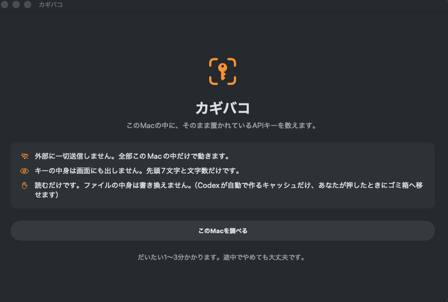

# カギバコ

**あなたのMacの中に、そのまま置かれているAPIキーを数えるMacアプリです。**

`.env` に書いた、`.zshrc` に書いた、設定ファイルに貼った ——
そういう「平文のままディスクに残っているAPIキー」が、今いくつあるかを数えます。

無料です。全部あなたのMacの中だけで動きます。



## このアプリがしないこと

- **外部に一切送信しません。** 通信そのものをしません。
- **キーの中身は表示しません。** 先頭7文字と文字数だけを出します(`sk-ant-****(108文字)`)。
  だから結果の画面をそのまま人に見せても安全です。
- **ファイルを勝手に書き換えません。** 読むだけです。対処は手順を見せるところまでで、
  あなたの `.zshrc` や `.env` をアプリが編集することはありません。
  唯一の例外は `~/.codex/shell_snapshots/`(起動のたびに作り直されるキャッシュ)で、
  ここだけはボタンでゴミ箱に移せます。消えて困るものではないからです。

## 使い方

### アプリ（こちらがおすすめです）

1. [Releases](https://github.com/matsumoto-akio/kagibako/releases) から `Kagibako-x.y.z.dmg` をダウンロード
2. 開いて「カギバコ」をアプリケーションフォルダにドラッグ
3. 起動して「このMacを調べる」を押す

1〜3分で終わります。ターミナルは使いません。

Apple の公証(notarization)済みなので、「開発元が未確認のため開けません」の警告は出ません。

### コマンドライン

```bash
swift run kagibako-scan
```

調べる場所を指定することもできます。

```bash
swift run kagibako-scan ~/Developer
```

## 何を見つけるか

Anthropic / OpenAI / OpenRouter / Google / GitHub / Slack / AWS / Stripe / HuggingFace の
キー形式と、`API_KEY=` のような変数名からの推定です。

## 数え方 —— `grep` と何が違うか

`grep -r "sk-" ~` でも、それらしい行は出ます。でも出てきた数字はそのままでは使えません。
テスト用のダミーキー、ドキュメントの見本、さらには英文の一部
(`task-abstraction-and-layering` の中の `sk-abstraction-...`)まで混ざるからです。

**誤検出だらけの「77件」より、「本物は◯件」の方が役に立ちます。**
カギバコは検出を3段階に分けて、本物の可能性が高いものだけを主役の数字にします。

| 段階 | 中身 | 扱い |
| --- | --- | --- |
| 本物の可能性が高い | `.env` / `.zshrc` / 設定ファイルにあるベンダー固有の形式 | **画面トップの数字** |
| テスト用・サンプルの可能性が高い | `tests/` `fixtures/` `docs/` の中や、`sk_test_` のような値 | 参考として下に |
| 誤検出の可能性が高い | 変数名からの推定のみ | 参考として下に |

実測(開発者自身のMac、31,669ファイル): 分離前 51件 → **本物 38件 / 27ファイル**。
「使っていないはずのSlackのキー9件」は、全部ドキュメントの見本でした。

テスト用を**除外ではなく分離**にしているのは、テストのフォルダに本物のキーが
置かれている事故が実在するためです。見なかったことにはせず、必ず参考枠に出します。

## 並べ方 —— 27件は同じ重さではない

「本物 27ファイル」と出しても、全部を平らに並べたら、どこから手を付けるかは決まりません。
プロジェクトの中の `.env` にキーがあるのは普通の運用です。本当に困るのは、
**勝手に増える場所**と、**開くシェル全部に読み込まれる場所**です。

そこで「本物」の中を、置かれている場所の性格でさらに3層に分けます。

| 層 | 場所 | なぜ |
| --- | --- | --- |
| **いますぐ対処** | `.zshrc` などのシェル設定 / `~/.codex/shell_snapshots/` / ツールのグローバル設定 | 全シェルに読み込まれる、あるいは知らないうちに複製が増える |
| 確認した方がいい | ホームや Documents 直下の `.env` / `token.json` `credentials.json` などの認証ファイル | 置き場所として不自然。忘れられたまま残りやすい |
| そのままでよい可能性が高い | プロジェクトフォルダ配下の `.env` | 通常の運用。`.gitignore` に入っていれば、まず問題にならない |

画面トップの大きな数字は「いますぐ対処」の件数です。
実測(開発者自身のMac): 本物 38件 / 27ファイルのうち、**いますぐ対処は 12件 / 10ファイル**。

さらに、ファイルごとにその場所に応じた手順とコマンドを表示します(`security add-generic-password`
でのキーチェーン移行、`git check-ignore` での確認など)。**実行はしません。コピーできるだけです。**

以下は「平文のキー」ではないので除外します。

- `YOUR_API_KEY` のようなドキュメントの見本
- `process.env.FOO` `$(...)` `op://` のような、別の場所から読んでいる書き方

`node_modules` や `.git` など、自分で書いたものではない場所は見に行きません。

## 見つけた後にやること

27件あっても、対処のパターンは場所の種類ぶんしかありません。やることは3つです。

1. **スナップショットを捨てる**
2. **`.zshrc` から `export` を消してキーチェーンに移す**
3. **プロジェクトの `.env` は `.gitignore` に入っているか確認する**

### いますぐ対処

#### `~/.codex/shell_snapshots/*.sh`

**なぜ危ないか** —— Codexが起動のたびに作るファイルです。そのときの環境変数がそのままコピーされるので、
キーも一緒に保存されます。消しても次の起動でまた作られます。

1. このアプリの「ゴミ箱に入れる」を押す(キャッシュなので消しても壊れません)
2. ただし再生成されるので、次の `.zshrc` の対処とセットでやってください

#### `~/.zshrc` に `export` でキーを書いている

**なぜ危ないか** —— ここに書いた値が、起動のたびにスナップショットへコピーされます。増殖の元はここです。

1. キーチェーンに保存する

   ```bash
   security add-generic-password -a "$USER" -s ANTHROPIC_API_KEY -w
   ```

2. `.zshrc` から `export` の行を消す
3. 必要なときだけ取り出す

   ```bash
   security find-generic-password -a "$USER" -s ANTHROPIC_API_KEY -w
   ```

   ※ この結果を `.zshrc` で毎回 `export` すると、結局スナップショットに載ります。
   使うときだけ実行する形にしてください。

4. 最後に、発行元でキーを再発行して古いキーを失効させる

   ※ 順番が大事です。先に失効させると、動いているものが止まります。

#### ツールのグローバル設定(`~/.claude/settings.local.json` など)

該当のキー項目を消して、ツール側でログインし直してください。

### 確認した方がいい

#### ホーム直下や Documents 直下の `.env`

そのフォルダがGitHubに上がっていないか確認してください。プロジェクトの中に移すのが安全です。

#### `credentials.json` / `token.json` / `auth.json`

使っていないサービスのものなら消してください。
使っているなら、発行元でトークンを作り直せるか確認してください。

### そのままでよい可能性が高い

#### プロジェクトフォルダの `.env`

`.env` にキーを書くのは通常の運用です。確認するのは1点だけ、`.gitignore` に入っているかどうか。

```bash
git check-ignore -v .env
```

何か表示されれば、gitの管理から外れています。何も出なければ、`.gitignore` に `.env` を追加してください。

---

**このアプリができるのは、場所を教えるところまでです。**
直すのはあなたの手で、1つずつ確認しながら進めてください。
全部を一度に直す必要はありません。まず「いますぐ対処」の分だけで、リスクの大半は減ります。

## 正直に書いておくこと

**これは「絶対に漏れなくなる」魔法ではありません。**

キーチェーンに移しても、プログラムが動く瞬間には、そのプログラムにキーが渡ります。
そこまで防げるわけではありません。

それでも、ディスクの上に平文で置きっぱなしにするのをやめるだけで、消せるリスクはあります。

- うっかり GitHub に上げてしまう
- 画面共有やスクショに写り込む
- 古いフォルダに残ったまま忘れ去られる
- 知らないところで勝手に複製される(`~/.codex/shell_snapshots/` など)

このアプリは**その「置きっぱなし」を数えるだけ**の道具です。

## 動作環境

macOS 13 以降 / Swift 5.9 以降

デスクトップや書類の中まで調べるには、
システム設定 → プライバシーとセキュリティ → フルディスクアクセス で許可が要ります。
許可しなくても動きます(読めなかった件数として出ます)。

## 開発

```bash
swift build
swift test
./scripts/build_app.sh      # .build/カギバコ.app を作る(開発用のアドホック署名)
./scripts/make_icns.sh      # アイコンを作り直す
```

### 配布

```bash
./scripts/release.sh 0.1.0
```

ビルド → Developer ID 署名(Hardened Runtime) → DMG → 公証 → staple →
GitHub Release 公開まで一本で通します。公開の直前に確認を求めます。

公証まででいったん止めるには `SKIP_PUBLISH=1 ./scripts/release.sh 0.1.0`。

必要なもの:

- Apple Developer Program の `Developer ID Application` 証明書(キーチェーンに導入済みであること)
- notarytool のキーチェーンプロファイル `AC_NOTARY`

```bash
xcrun notarytool store-credentials "AC_NOTARY" \
  --apple-id <Apple ID> --team-id <Team ID> --password <App用パスワード>
```

## ライセンス

MIT
